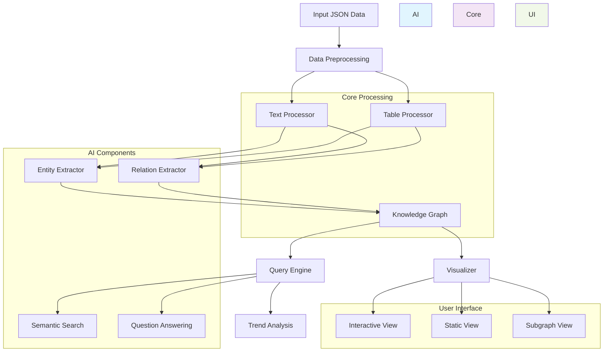
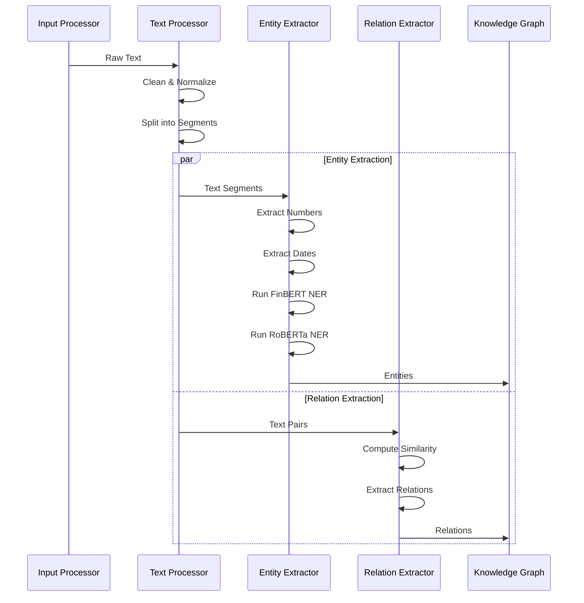
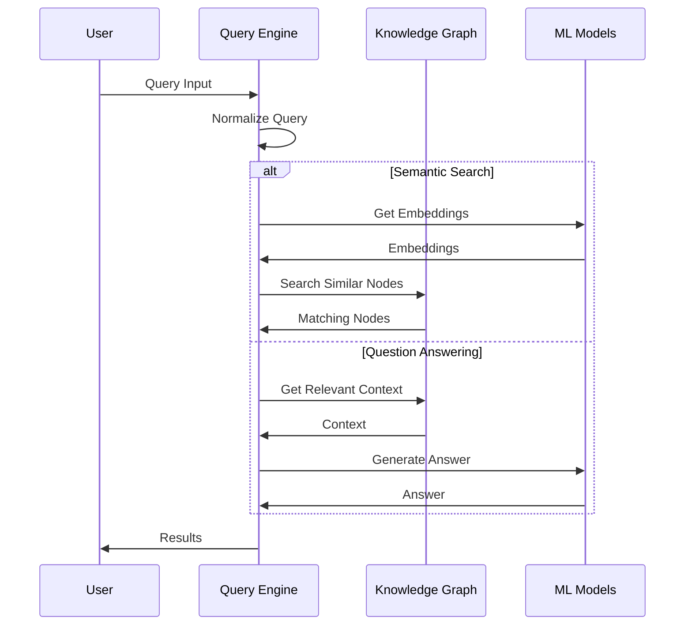

# System Architecture Diagram

## Overall System Architecture

```mermaid
graph TB
    Input[Input JSON Data] --> Preprocessing[Data Preprocessing]
    Preprocessing --> TextProcessor[Text Processor]
    Preprocessing --> TableProcessor[Table Processor]
    
    TextProcessor --> EntityExtractor[Entity Extractor]
    TextProcessor --> RelationExtractor[Relation Extractor]
    TableProcessor --> EntityExtractor
    TableProcessor --> RelationExtractor
    
    EntityExtractor --> KG[Knowledge Graph]
    RelationExtractor --> KG
    
    KG --> QueryEngine[Query Engine]
    KG --> Visualizer[Visualizer]
    
    QueryEngine --> SemanticSearch[Semantic Search]
    QueryEngine --> QA[Question Answering]
    QueryEngine --> TrendAnalysis[Trend Analysis]
    
    Visualizer --> Interactive[Interactive View]
    Visualizer --> Static[Static View]
    Visualizer --> SubgraphView[Subgraph View]

    subgraph "AI Components"
        style AI fill:#e1f5fe
        EntityExtractor
        RelationExtractor
        SemanticSearch
        QA
    end

    subgraph "Core Processing"
        style Core fill:#f3e5f5
        TextProcessor
        TableProcessor
        KG
    end

    subgraph "User Interface"
        style UI fill:#f1f8e9
        Interactive
        Static
        SubgraphView
    end
```

## Text Processing Flow

```mermaid
sequenceDiagram
    participant IP as Input Processor
    participant TP as Text Processor
    participant EE as Entity Extractor
    participant RE as Relation Extractor
    participant KG as Knowledge Graph

    IP->>TP: Raw Text
    TP->>TP: Clean & Normalize
    TP->>TP: Split into Segments
    
    par Entity Extraction
        TP->>EE: Text Segments
        EE->>EE: Extract Numbers
        EE->>EE: Extract Dates
        EE->>EE: Run FinBERT NER
        EE->>EE: Run RoBERTa NER
        EE->>KG: Entities
    and Relation Extraction
        TP->>RE: Text Pairs
        RE->>RE: Compute Similarity
        RE->>RE: Extract Relations
        RE->>KG: Relations
    end
```

## Query Processing Flow

```mermaid
sequenceDiagram
    participant U as User
    participant QE as Query Engine
    participant KG as Knowledge Graph
    participant ML as ML Models

    U->>QE: Query Input
    QE->>QE: Normalize Query
    
    alt Semantic Search
        QE->>ML: Get Embeddings
        ML->>QE: Embeddings
        QE->>KG: Search Similar Nodes
        KG->>QE: Matching Nodes
    else Question Answering
        QE->>KG: Get Relevant Context
        KG->>QE: Context
        QE->>ML: Generate Answer
        ML->>QE: Answer
    end
    
    QE->>U: Results
```