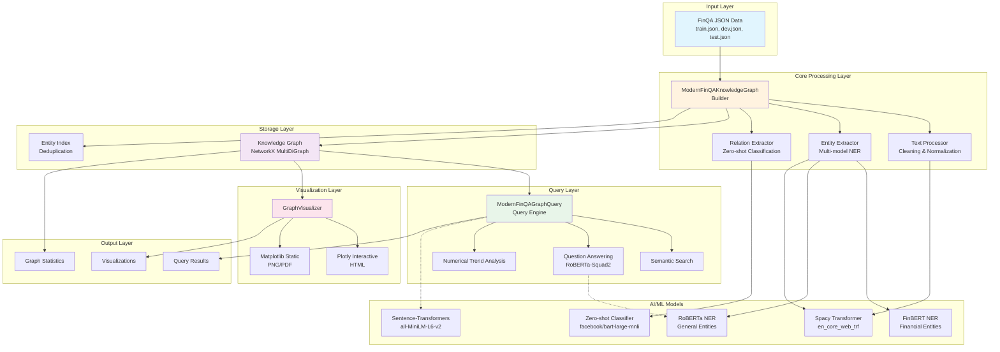
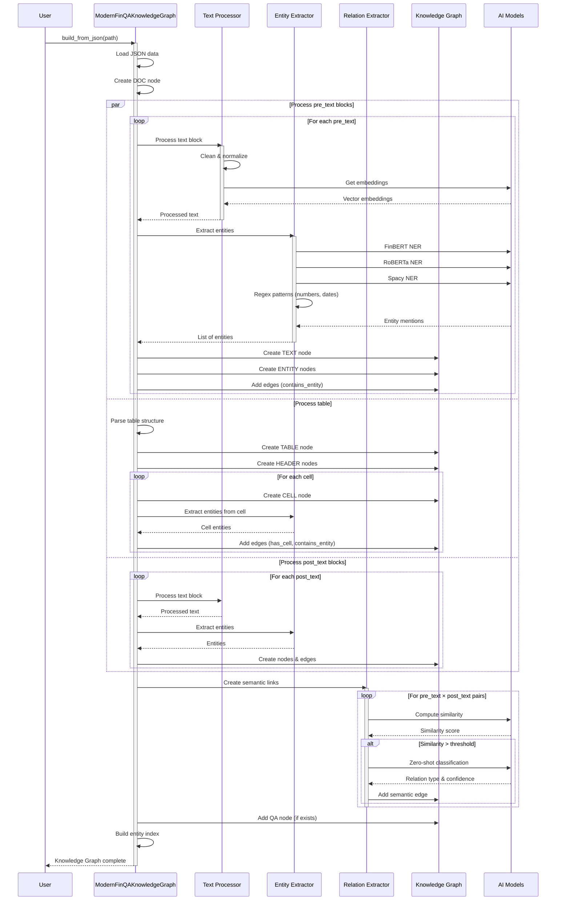
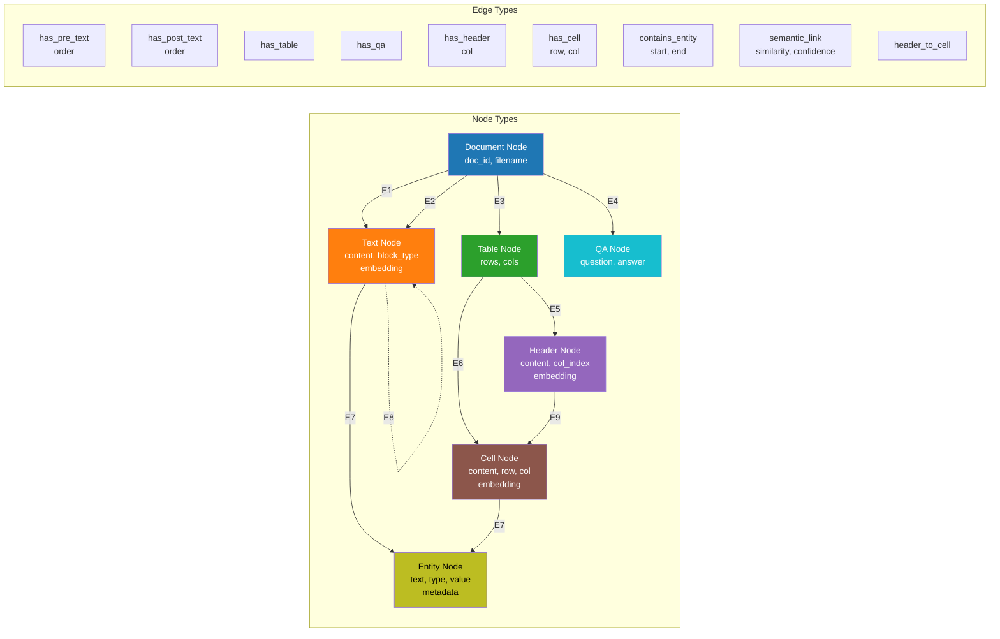
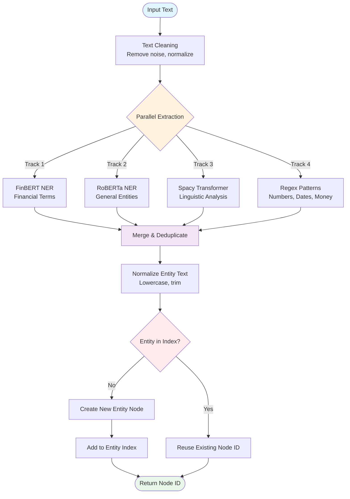
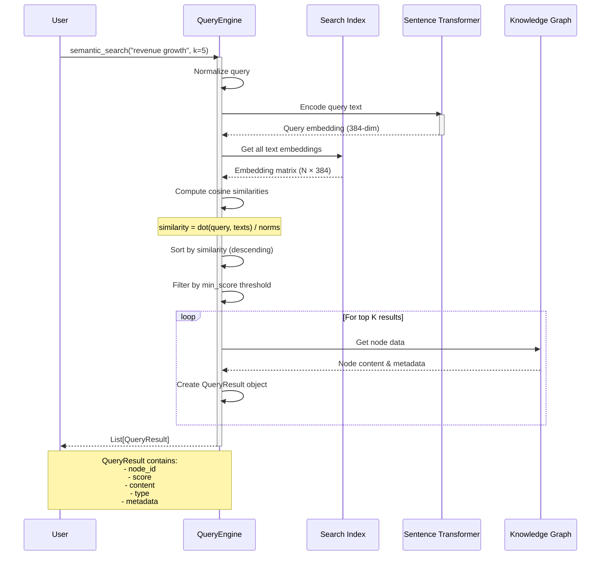
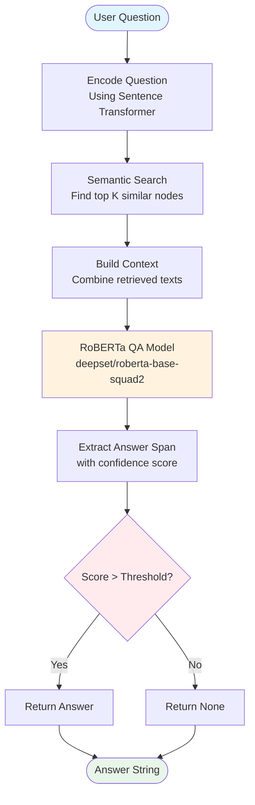
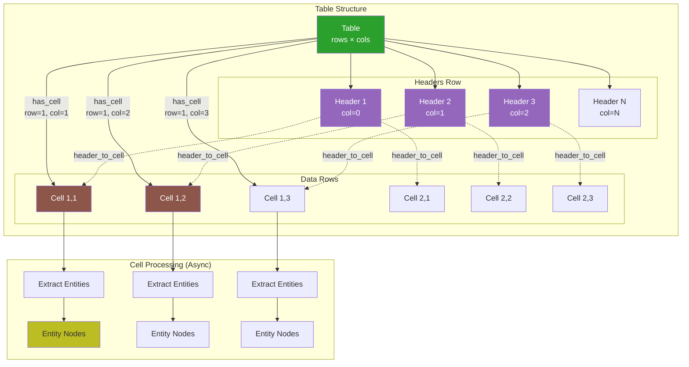
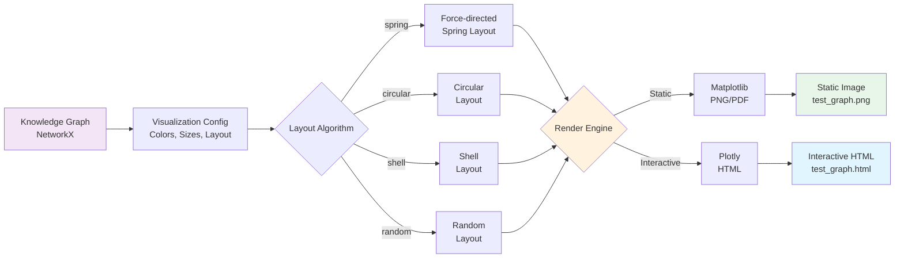
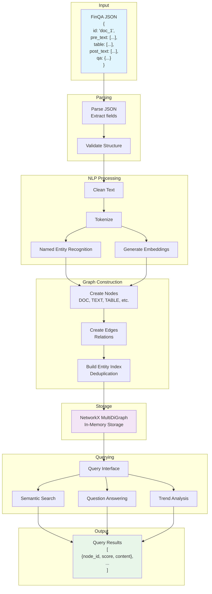
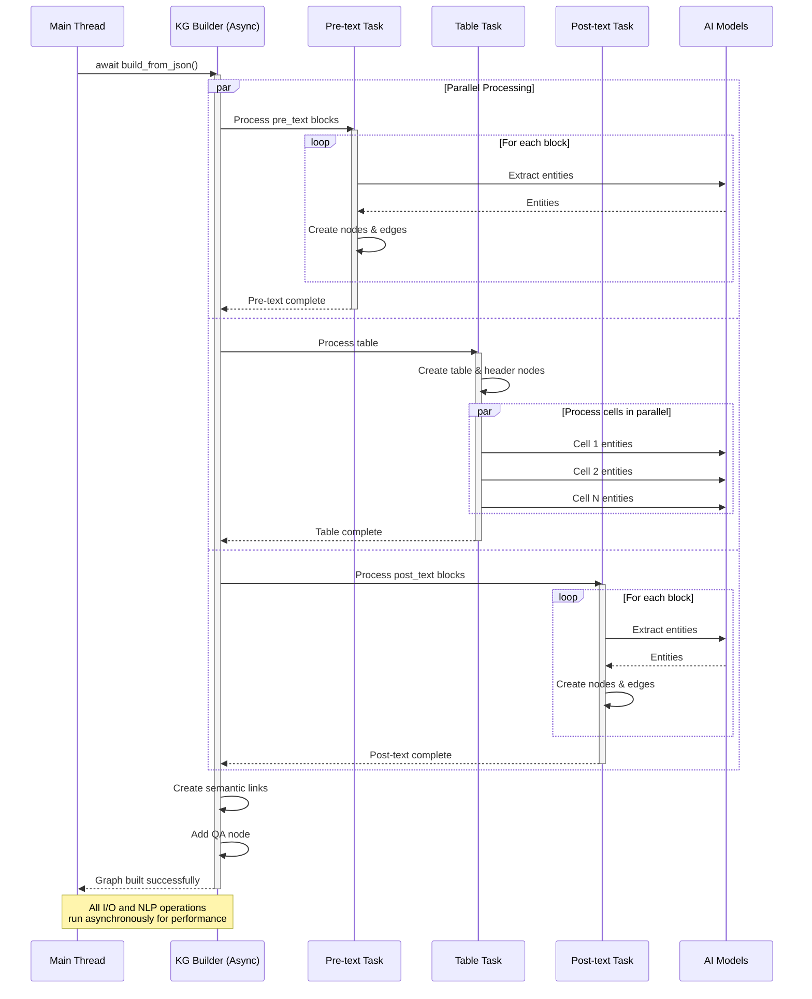

# Mermaid Diagrams - FinQA Knowledge Graph System

## 1. Tổng Quan Kiến Trúc Hệ Thống



## 2. Quy Trình Xây Dựng Knowledge Graph (Chi Tiết)



## 3. Cấu Trúc Node và Edge trong Knowledge Graph



## 4. Entity Extraction Pipeline (Multi-Model Approach)



## 5. Query Engine - Semantic Search Flow



## 6. Question Answering Pipeline



## 7. Table Processing - Parallel Cell Processing



## 8. Visualization Pipeline



## 9. Data Flow - From JSON to Query Results



## 10. Async Processing Model



---

## Chú Thích

### Node Types (Các loại Node)
- **DOC**: Document node - điểm bắt đầu cho mỗi tài liệu
- **TEXT**: Text block node - đoạn văn bản (pre/post)
- **TABLE**: Table structure node - cấu trúc bảng
- **HEADER**: Table header node - tiêu đề cột
- **CELL**: Table cell node - ô trong bảng
- **ENTITY**: Entity node - thực thể (số, ngày, tên, v.v.)
- **QA**: Question-Answer node - cặp hỏi đáp

### Edge Types (Các loại Edge)
- **has_pre_text/has_post_text**: Document → Text
- **has_table**: Document → Table
- **has_qa**: Document → QA
- **has_header**: Table → Header
- **has_cell**: Table → Cell
- **contains_entity**: Text/Cell → Entity
- **semantic_link**: Text ↔ Text (có similarity cao)
- **header_to_cell**: Header → Cell

### AI Models Used
1. **Spacy Transformer** (`en_core_web_trf`): NLP cơ bản
2. **FinBERT** (`yiyanghkust/finbert-pretrained-ner`): Financial NER
3. **RoBERTa** (`jean-baptiste/roberta-large-ner-english`): General NER
4. **Sentence Transformer** (`all-MiniLM-L6-v2`): Text embeddings
5. **Zero-shot Classifier** (`facebook/bart-large-mnli`): Relation classification
6. **QA Model** (`deepset/roberta-base-squad2`): Question answering
```
