# QUY TRÌNH XÂY DỰNG KNOWLEDGE GRAPH

## 1. OVERVIEW - Luồng Dữ Liệu Tổng Quan

```mermaid
graph TB
    Start[FinQA Sample] --> Extract[Trích xuất dữ liệu]
    Extract --> Table[Table Data]
    Extract --> PreText[Pre Text]
    Extract --> PostText[Post Text]
    Extract --> QA[Question & Program]
    
    Table --> KG[Knowledge Graph Builder]
    PreText --> KG
    PostText --> KG
    
    KG --> Graph[Structured Knowledge Graph]
    
    QA --> Retriever[Argument Retriever]
    Graph --> Retriever
    
    Retriever --> Program[Program Executor]
    Program --> Answer[Final Answer]
    
    style Start fill:#e1f5ff
    style Graph fill:#c8e6c9
    style Answer fill:#fff9c4
```



## 2. CHI TIẾT XÂY DỰNG KNOWLEDGE GRAPH


## 3. CẤU TRÚC NODE TRONG GRAPH


## 4. PARSE CELL VALUE - Chi Tiết

```mermaid
flowchart TD
    Start[Cell Value String] --> Trim[Trim whitespace]
    Trim --> CheckEmpty{Empty or - or N/A?}
    
    CheckEmpty -->|Yes| ReturnNull[Return: None, TEXT, {}]
    CheckEmpty -->|No| DetectFormat[Detect Format]
    
    DetectFormat --> HasPct{Contains %}
    DetectFormat --> HasDollar{Contains $}
    DetectFormat --> HasParen{Has parentheses?}
    
    HasPct -->|Yes| MarkPct[metadata.is_percent = True]
    HasDollar -->|Yes| MarkCurr[metadata.is_currency = True]
    HasParen -->|Yes| MarkNeg[metadata.is_negative = True]
    
    MarkPct --> Clean[Remove formatting]
    MarkCurr --> Clean
    MarkNeg --> Clean
    HasPct -->|No| Clean
    HasDollar -->|No| Clean
    HasParen -->|No| Clean
    
    Clean --> RemoveComma[Remove commas]
    RemoveComma --> RemoveDollar[Remove $]
    RemoveDollar --> RemovePct[Remove %]
    RemovePct --> HandleParen[Handle parentheses]
    
    HandleParen --> TryParse{Can parse as float?}
    
    TryParse -->|Yes| ParseNum[value = float parsed]
    TryParse -->|No| ReturnText[Return: None, TEXT, metadata]
    
    ParseNum --> ApplyNeg{Is negative?}
    ApplyNeg -->|Yes| Negate[value = -value]
    ApplyNeg -->|No| DetermineLabel
    Negate --> DetermineLabel
    
    DetermineLabel --> CheckLabel{Format type?}
    CheckLabel -->|is_currency| LabelMoney[label = MONEY]
    CheckLabel -->|is_percent| LabelPct[label = PERCENT]
    CheckLabel -->|neither| LabelNum[label = NUMBER]
    
    LabelMoney --> Return[Return: value, label, metadata]
    LabelPct --> Return
    LabelNum --> Return
    
    style Start fill:#e1f5ff
    style Return fill:#c8e6c9
    style ReturnNull fill:#ffcdd2
    style ReturnText fill:#ffcdd2
```

## 5. VALUE INDEXING - Tạo Index để Tìm Nhanh

```mermaid
flowchart LR
    subgraph Creation["Node Creation"]
        Cell[Create Cell Node] --> GetValue[Get numeric value]
        GetValue --> CheckPct{Is percentage?}
    end
    
    subgraph Indexing["Value Indexing"]
        CheckPct -->|No| IdxNormal[value_index[value] = node_id]
        CheckPct -->|Yes| IdxBoth[Index both forms]
        
        IdxBoth --> Idx1[value_index[23.6] = node_id]
        IdxBoth --> Idx2[value_index[0.236] = node_id]
    end
    
    subgraph Lookup["Fast Lookup"]
        Query[Search for value] --> HashLookup[O1 Hash Lookup]
        HashLookup --> GetNodes[value_index[target]]
        GetNodes --> Instant[Instant Results!]
    end
    
    style Indexing fill:#fff9c4
    style Lookup fill:#c8e6c9
```

## 6. ARGUMENT RETRIEVAL - Từ Program đến Data


## 7. ĐẦY ĐỦ PIPELINE - End to End


## 8. EXAMPLE - Concrete Sample

**Input:**
```json
{
  "table": [
    ["Year", "Revenue", "Percent"],
    ["2018", "$9896", "23.6%"],
    ["2017", "$7510", "19.6%"]
  ],
  "qa": {
    "question": "what was the total operating expenses in 2018 in millions",
    "program": "divide(9896, 23.6%)",
    "answer": "41932"
  }
}
```

**KG Construction Flow:**

```mermaid
graph TD
    subgraph Input
        T[Table 3x3]
        Q[Question]
        P[Program]
    end
    
    subgraph KGNodes["Built Nodes"]
        TN[TABLE_1]
        R0[ROW_1 header]
        R1[ROW_2 data]
        R2[ROW_3 data]
        
        C1["CELL_1 [0,0] = 'Year'"]
        C2["CELL_2 [0,1] = 'Revenue'"]
        C3["CELL_3 [0,2] = 'Percent'"]
        C4["CELL_4 [1,0] = '2018'"]
        C5["CELL_5 [1,1] = '$9896'<br/>value=9896<br/>is_currency=true"]
        C6["CELL_6 [1,2] = '23.6%'<br/>value=23.6<br/>is_percent=true"]
    end
    
    subgraph Index["Value Index"]
        I1["9896 → [CELL_5]"]
        I2["23.6 → [CELL_6]"]
        I3["0.236 → [CELL_6]"]
    end
    
    subgraph Retrieval["Argument Retrieval"]
        P --> A1["Need: 9896"]
        P --> A2["Need: 23.6%"]
        
        A1 --> I1
        A2 --> I2
        
        I1 --> Found1[✓ CELL_5]
        I2 --> Found2[✓ CELL_6]
    end
    
    subgraph Execution
        Found1 --> E["divide(9896, 23.6)"]
        Found2 --> E
        E --> Ans["= 41932"]
    end
    
    T --> TN
    TN --> R0
    TN --> R1
    R0 --> C1
    R0 --> C2
    R1 --> C5
    R1 --> C6
    
    C5 --> I1
    C6 --> I2
    C6 --> I3
```



---

## KEY POINTS

1. **Table → Structured topology** (TABLE → ROW → CELL)
2. **Cell parsing → Rich metadata** (%, $, negative)
3. **Value indexing → O(1) lookup** (instant search)
4. **Context filtering → Accurate retrieval** (column/row keywords)
5. **Program execution → State management** (#0, #1 intermediate results)

Đây là quy trình hoàn chỉnh để xây dựng Knowledge Graph từ dữ liệu FinQA!
